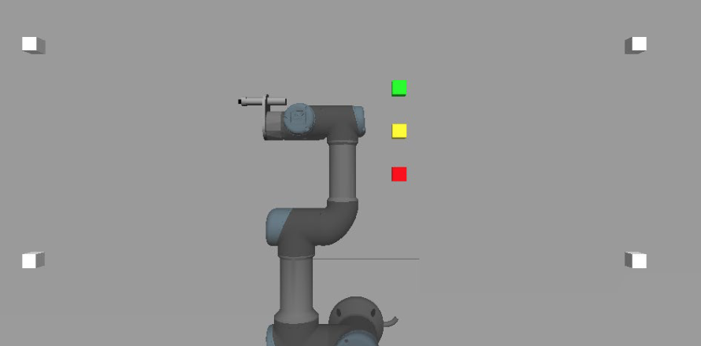

# UR3_Simulation
ROS + Gazebo Simulation to conduct pick and place operations using an overhead camera and OpenCV for block detection. White blocks are used for coordinate reference points.

Example Usage: 
